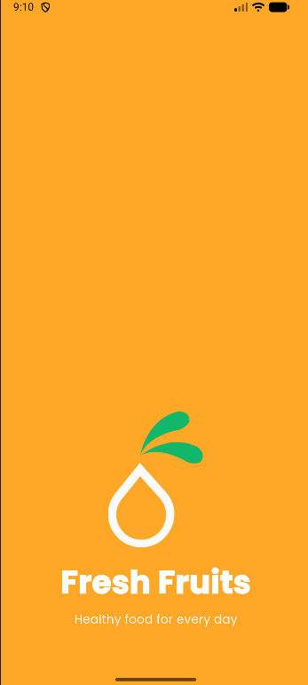
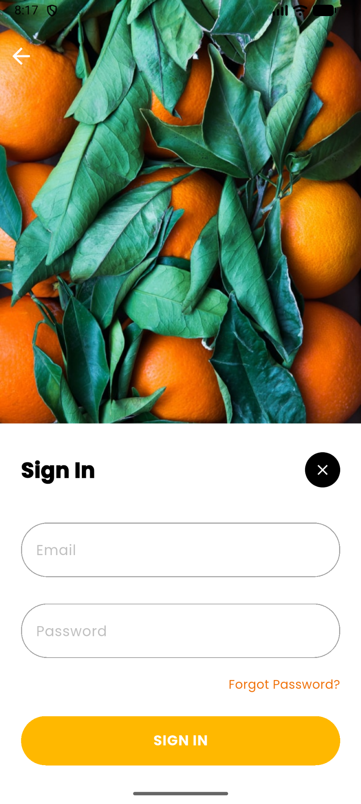
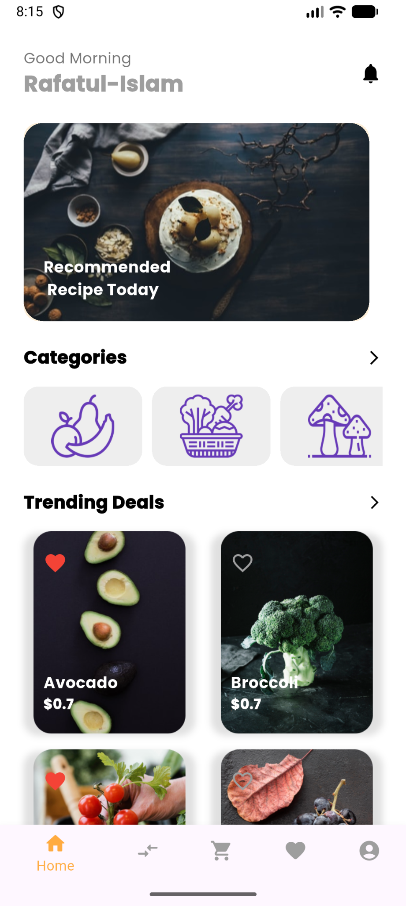
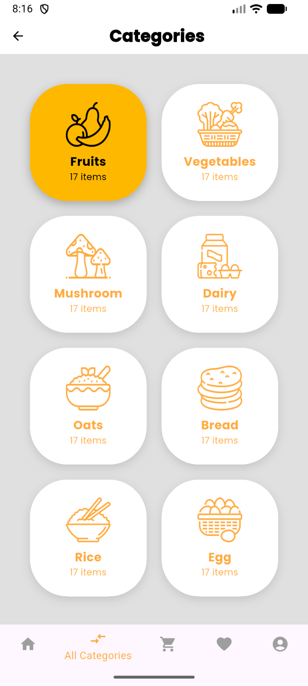

# Fresh Fruits App


Fresh Fruits is a simple Flutter mobile application for a fruit shopping idea. The app contains several screens such as splash screen, onboarding screen, login screen, register screen, home screen, categories screen, and bottom navigation.


This project was created for the Git and GitHub training assignment. The main goal of the project is to practice using Git commands, GitHub repository, commits, branches, issues, pull requests, and GitHub Pages.


## Repository Link


https://github.com/Ahmed-Alshobaki/github-training-project


## Online Project Link


https://ahmed-alshobaki.github.io/github-training-project/


## Project Idea


The idea of the app is to present a simple and clean fruit shopping application. The user can open the app, move between screens, view fruit categories, and see different product cards.


The project is small and simple, but it has a clear structure and was useful for practicing Git and GitHub workflow.


## Main Features


* Splash screen

* Onboarding screen

* Login screen

* Register screen

* Home screen

* Categories screen

* Bottom navigation

* Fruit category cards

* Reusable widgets

* Simple and clean UI design

* Project uploaded to GitHub

* Issue created on GitHub

* Pull Request created on GitHub

* Project published online using GitHub Pages


## App Screens














## Technologies Used


* Flutter

* Dart

* Git

* GitHub

* GitHub Pages


## Project Structure


```text

lib/

  data/

    app_data.dart


  models/

    category_item.dart

    home_item.dart


  screens/

    bottom_nav.dart

    home_screen.dart

    login_screen.dart

    my_categories_screen.dart

    onboarding_screen.dart

    register_screen.dart

    splash_screen.dart


  screenshots/

    Categories.png

    home.png

    login.png


  widgets/

    category_big_card.dart

    category_small_card.dart

    my_button.dart

    my_input_text_field.dart

    my_offer_big_card.dart

    trending_deal_card.dart


  main.dart


test/

web/

```


## Code Organization


The project is organized into simple folders to make the code easier to read and manage.


* `data`: contains the app data used in the project.

* `models`: contains the data models for categories and home items.

* `screens`: contains the main screens of the application.

* `screenshots`: contains screenshots used for project documentation.

* `widgets`: contains reusable UI components used in different screens.

* `main.dart`: the main entry point of the Flutter application.

* `web`: contains the web files for Flutter Web support.


This structure helps keep the project clean and makes it easier to update or add new features later.


## Git Workflow


The project was developed locally using Git. I created multiple commits during the development process.


A feature branch was created for a design update:


```text

feature/design-update

```


This branch was used to update the splash screen design. After finishing the update, I pushed the branch to GitHub, created a Pull Request, and merged it with the main branch.


## Important Git Commands Used


```bash

git init

git add .

git commit -m "Initial project setup"

git status

git log --oneline

git branch

git checkout -b feature/design-update

git checkout main

git merge feature/design-update

git remote add origin https://github.com/Ahmed-Alshobaki/github-training-project.git

git push -u origin main

git push -u origin feature/design-update

```


## GitHub Issue


I created an Issue on GitHub with the title:


```text

Improve UI Design

```


The issue was used to suggest improving the user interface and making the app look better and easier to use.


## Pull Request


I created a Pull Request from:


```text

feature/design-update

```


to:


```text

main

```


The Pull Request included a small UI design update in the splash screen.


## GitHub Pages and Online Deployment


The project was published online using GitHub Pages.


GitHub Pages settings:


```text

Source: Deploy from a branch

Branch: main

Folder: /docs

```


This means the project is deployed online and can be accessed through a public GitHub Pages link.


Online project link:


```text

https://ahmed-alshobaki.github.io/github-training-project/

```


## How to Run the Project


Clone the repository:


```bash

git clone https://github.com/Ahmed-Alshobaki/github-training-project.git

```


Open the project folder:


```bash

cd github-training-project

```


Install dependencies:


```bash

flutter pub get

```


Run the project:


```bash

flutter run

```


## Student


Ahmed Alshobaki
